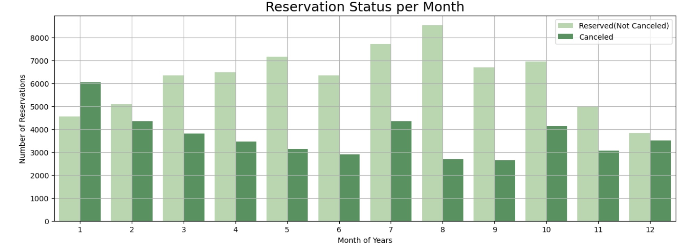

# Project 2: Hotel Booking Analysis with Python (To reduce cancellation rate)


---
## Project Steps:
* Create a Problem Statement
* Identify the data you want to analyze
* Explore and Clean the data: inconsistency, inappropriate, missing data, duplicate data (Remove before perform the analysis)
* Clean raw dataset → then perform analysis → analyze the data to get useful insights.
---

## Business Problem:

In recent years, both City Hotel and Resort Hotel have experienced high cancellation rates, leading to several consequential issues such as reduced revenue and suboptimal room utilization. Consequently, lowering cancellation rates has become the primary goal for both hotels to enhance revenue generation efficiency. Our report aims to offer comprehensive business advice to address this problem by analyzing hotel booking cancellations and other factors irrelevant to their business and annual revenue generation.

---
## Assumptions:

1. There were no unusual occurrences between 2015 and 2017 that would greatly affect the data used.
2. The information is still up-to-date and can be effectively utilized to analyze and develop plans for hotels efficiently.
3. There are no unexpected negative consequences for the hotels when implementing any recommended techniques.
4. The hotels are currently not using any of the suggested solutions.
5. Booking cancellations are the primary factor that has the most substantial impact on revenue generation.
6. Cancellations lead to unoccupied rooms for the duration of the originally booked period.
7. Clients can cancel their hotel bookings within the same calendar year they made the reservations.
---
## Research Question:

1. What are the factors influencing hotel reservation cancellations?
2. What strategies can hotels implement to effectively reduce booking cancellations and optimize revenue generation?
3. In what ways can we support hotels so that they can make more informed and strategic pricing and promotional decisions, ultimately driving revenue growth and maximizing profitability?

---
## Hypotheses:

1. Price Sensitivity: The price of the reservation affects the likelihood of cancellation, with higher-priced bookings experiencing higher cancellation rates.
2. Cancellation Policy Impact: The stringency of the hotel's cancellation policy influences cancellation rates, with more lenient policies leading to higher cancellation rates.
3. Competitive Offerings: Avalability of better amenities or services at competing hotels may prompt guests to cancel their reservations.
4. Booking Channel Influence: Cancellation rates differ based on the booking channel used, such as direct booking through the hotel website, online travel agencies, or offline travel agents.

---
## Analysis & Findings:


---
## Recommendations:

---


---
---
---
## Dataset:

**Number of Entries:** The dataset consists of 119,390 entries.

**Columns:** The dataset contains 36 columns, which represent various attributes related to hotel bookings.

**Data Types:** 
* A majority of the columns, 16 to be precise, are of the object data type (often representing strings or categorical data).
* 16 columns are of the int64 data type, representing integer values.
* 4 columns are of the float64 data type, which typically denotes decimal values.
  
**Missing Values:**
* The column children has 4 missing values.
* The column country has 488 missing values.
* The column agent has 16,340 missing values.
* The column company has a significant number of missing values, totaling 112,593.


# Hotel Booking Analysis (2015, 2016 and 2017)


## 1. Importing Libraries


```python
import pandas as pd
import matplotlib.pyplot as plt
import seaborn as sns
import warnings
warnings.filterwarnings("ignore")
```
## 2. Loading the dataset
```python
df=pd.read_csv("hotel_booking.csv")      #Load .csv file or load dataset
df=df.drop(columns=['name','email','phone-number', 'credit_card'])    #drop some columns
```
## 3. Exploratory Data Analysis and Data Cleaning
```python
df.head(3) # show rows from top
```
```python
df.tail(3) # show last rows 
```
```python
df.shape # to know the shape of dataframe
```
```python
df.columns  #list of columns
```
```python
df.info()   #to check data types
```
```python
df["reservation_status_date"]=pd.to_datetime(df["reservation_status_date"])  # convert object to datetime datatype
```
```python
df.describe(include = "object")          #describe function only use for numeric value but if you use include = 'object', then you will get summary statistics for object
```
```python
for col in df.describe(include = "object").columns:
    print(col)
    print(df[col].unique())
    print('*'*100)
```
## 4. Remove NULL values
```python
df.isnull().sum()   #df.isna().sum()
```

```python
df=df.drop(columns=["agent","company"])  #drop because it has more NaN values
```
```python
df.dropna(inplace=True)
df.shape
```
```python
df.isnull().sum()
```
```python
df.describe()   # remove outliers
```
```python
df=df[df["adr"]<5000]
```
```python
df.describe()
```
## 5. Data Analysis and Visualization

#### 5.1 - Count Canceled and Non canceled reservation
```python
cancellation_perc= df["is_canceled"].value_counts(normalize=True)
cancellation_perc           # 1 = canceled
```
```python
plt.figure(figsize = (5,4))     #set size of the plot
plt.title("Count Reservation Status")
plt.bar(["Reserved(Not Canceled)","Canceled"],df["is_canceled"].value_counts(), edgecolor = 'k', color='g', width = 0.5)
plt.show()
```


#### 5.2 - Reservation Status of Different Hotels
```python
plt.figure(figsize = (8,4))

ax1= sns.countplot(x="hotel", hue = "is_canceled", data= df, palette="Blues")
legend_labels,_=ax1. get_legend_handles_labels()

ax1.legend(bbox_to_anchor=(1,1))
plt.legend(["Reserved(Not Canceled)","Canceled"])

plt.title("Reservation Status of Different Hotels", size=18)
plt.xlabel("Type of Hotel")
plt.ylabel("Number of Reservations")

plt.show()
```

```python
resort_hotel = df[df["hotel"] == "Resort Hotel"]            #filter 
resort_hotel["is_canceled"].value_counts(normalize = True)
```
```python
city_hotel = df[df["hotel"] == "City Hotel"]            #filter 
city_hotel["is_canceled"].value_counts(normalize = True)
```
```python
resort_hotel = resort_hotel.groupby("reservation_status_date")[["adr"]].mean()
city_hotel = city_hotel.groupby("reservation_status_date")[["adr"]].mean()
```
#### 5.3 - Average Daily Rate of City and Resort Hotel
```python
plt.figure(figsize=(20, 8))
plt.title("Average Daily Rate of City and Resort Hotel", size=25)
plt.plot(resort_hotel.index, resort_hotel['adr'], label="Resort Hotel")
plt.plot(city_hotel.index, city_hotel['adr'], label="City Hotel")
plt.legend(fontsize=15)


#plt.xlabel("Date")
plt.ylabel("Average Daily Rate (ADR)", size =20)
plt.xticks(size=15)
plt.yticks(size=15)
#plt.grid(True)
plt.show()
```

#### 5.4 - Reservation Status per Month
```python
df['month'] = df["reservation_status_date"].dt.month         #date to month
plt.figure(figsize = (15,5))

ax1= sns.countplot(x="month", hue = "is_canceled", data= df, palette="Greens")


ax1.legend(bbox_to_anchor=(1,1))
plt.legend(["Reserved(Not Canceled)","Canceled"])

plt.title("Reservation Status per Month", size=18)
plt.xlabel("Month of Years")
plt.ylabel("Number of Reservations")
plt.grid(True)
plt.show()
```

#### 5.5 - ADR per Month
```python
plt.figure(figsize = (25,10))
plt.title("ADR per Month", fontsize = 20)

sns.barplot(x="month", y="adr", data = df[df["is_canceled"]==1].groupby("month")[["adr"]].mean().reset_index())

plt.xticks(size=15)
plt.yticks(size=15)

plt.xlabel("Month of Years")
plt.ylabel("Average Daily Rate")
plt.grid(True)
plt.show()
```

#### 5.6 - Compare Top 10 Countries with Cancellation Rate
```python
cancelled_data = df[df["is_canceled"]==1]
top_10_country= cancelled_data["country"].value_counts()[:10]
plt.figure(figsize = (8,8))
plt.title("Compare Top 10 Countries with Cancellation Rate", size=20)
plt.pie(top_10_country, autopct = "%.2f", labels= top_10_country.index)
plt.show()
```

```python
df['market_segment'].value_counts()
```
```python
df["market_segment"].value_counts(normalize =True)
```
```python
cancelled_data["market_segment"].value_counts(normalize= True)
```
#### 5.7 - Average Daily Rate (ADR)
```python
cancelled_df_adr = cancelled_data.groupby("reservation_status_date")[["adr"]].mean()
cancelled_df_adr.reset_index(inplace = True)
#cancelled_df_adr.sort_values("reservation_status_date", inplace=True)

not_cancelled_data= df[df["is_canceled"]==0]
not_cancelled_df_adr = not_cancelled_data.groupby("reservation_status_date")[["adr"]].mean()
not_cancelled_df_adr.reset_index(inplace= True)
#not_cancelled_df_adr.sort_values("reservation_status_date", inplace= True)

plt.figure(figsize=(20,8))
plt.title("Average Daily Rate (ADR)")
plt.plot(not_cancelled_df_adr["reservation_status_date"],not_cancelled_df_adr['adr'], label = "not cancelled", color="orange")
plt.plot(cancelled_df_adr["reservation_status_date"], cancelled_df_adr['adr'], label = "cancelled", color= "green")
plt.legend()

plt.show()

```


```python
cancelled_df_adr =cancelled_df_adr[cancelled_df_adr["reservation_status_date"]> "2015-12"]   #& cancelled_df_adr[]]
not_cancelled_df_adr =not_cancelled_df_adr[not_cancelled_df_adr["reservation_status_date"]> "2015-12"]   #& cancelled_df_adr[]]
```                                 
```python                   
plt.figure(figsize=(20,8))
plt.title("Average Daily Rate (ADR)")
plt.plot(not_cancelled_df_adr["reservation_status_date"],not_cancelled_df_adr['adr'], label = "not cancelled", color="orange")
plt.plot(cancelled_df_adr["reservation_status_date"], cancelled_df_adr['adr'], label = "cancelled", color= "green")
plt.legend()

plt.show()
```


# Thank You
## - Hardikkumar Malaviya
